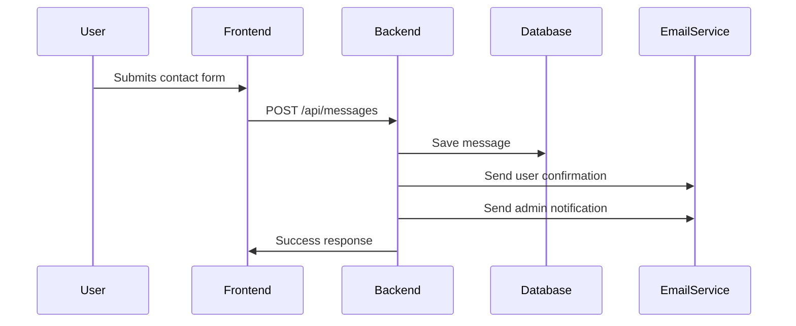

# 🌟 Melvin's Portfolio Project

**LIVE LINK:** [Portfolio]()

A modern, responsive portfolio website showcasing my skills, projects, and contact information. Built with cutting-edge technologies and designed for optimal user experience.

## ✨ Features

- **🚀 Modern UI/UX**  
  Sleek animations and gradient designs that match.

- **📱 Fully Responsive**  
  Looks great on all devices from mobile to desktop

- **📨 Contact System**  
  Message form with:

  - Database storage (MongoDB)
  - Auto-reply emails to users
  - Notification emails to admin
  - Beautiful HTML templates

- **🛠️ Skills Management**

  - Admin dashboard for managing skills,project and overall portfolio.
  - Public display in about section
  - Interactive progress bars

- **📂 Project Showcase**  
  Work Display:
  - Images
  - Tags
  - Descriptions
  - Live links

## 🛠️ Technologies Used

### Frontend

- 
- 
- 
- 

### Backend

- 
- 

- 
- 

### Deployment

## 📂 Project Structure

```bash
portfolio/
├── client/ # Frontend React app
│ ├── public/
│ └── src/
│ ├── components/ # Reusable components
│ ├── pages/ # Page components
│ └── App.js # Main app component
│
├── server/ # Backend server
│ ├── controllers/ # Route controllers
│ ├── models/ # MongoDB models
│ ├── routes/ # API routes
│ └── server.js # Express server
│
├── .env.example # Environment variables template
└── README.md # This file
```

## 🚀 Getting Started

### Prerequisites

- Node.js (v20+)
- MongoDB Atlas account/CosmosDB
- Email service credentials

### Installation

**Clone the repository:**

```bash
 https://github.com/Melvins-Simon/portfolio.git
```

Install dependencies for both client and server:

```bash
npm install #server
cd client && npm install #client
```

## **Set up environment variables:**

Create .env file server directory

Use .env.example as a in the template below and add you details

```bash

COSMOS_URI= or MONGO_URI=
PORT=5000
NODE_ENV=development
NODEMAILER_PASSWORD=
NODEMAILER_USER=
SECRETE_KEY=
CLOUDINARY_CLOUD_NAME=
CLOUDINARY_API_KEY=
CLOUDINARY_API_SECRET=
ADMIN_EMAIL=
```

Start the development servers:

```bash
# In Server directory
npm run server

# In Client directory
npm run dev
```

📬 **Contact System Workflow**



📜 **License:**
This project is licensed under the MIT License - see the [LICENSE](LICENSE) file for details.

Developed with ❤️ by [Melvins Simon](https://github.com/Melvins-Simon)
